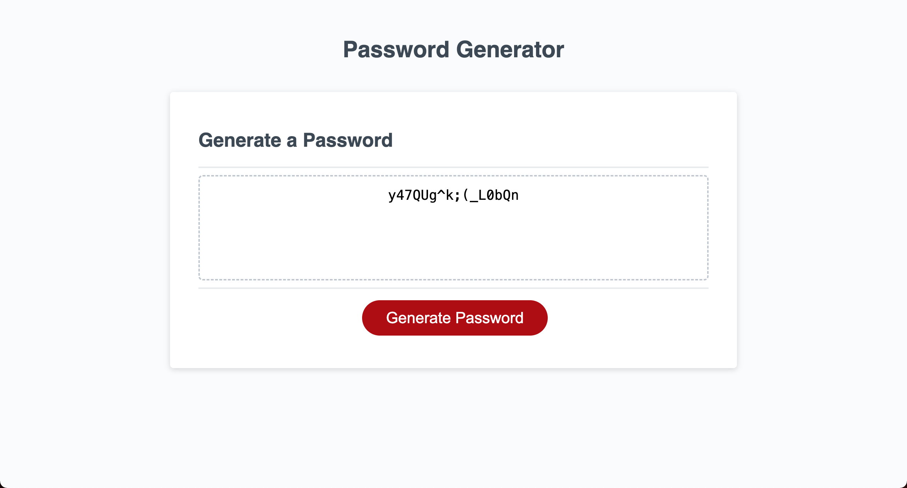

# JavaScript Password Generator

## Description
- This application randomly generates a password based on the length (8-128 characters) and charactyper types (lowercase, uppercase, numeric and special) selected by the user. Using a series of prompts and confirm windows, the user must select which criteria to include in the password. After all prompts are answered and at least one character type is selected, the password is generated and written to the page.

## Usage
> [Link to deployed application](https://kyoriku.github.io/password-generator/)

## Credits
- [MDN - Window: prompt() method](https://developer.mozilla.org/en-US/docs/Web/API/Window/prompt)
- [MDN - Window: alert() method](https://developer.mozilla.org/en-US/docs/Web/API/Window/alert)
- [MDN - Window: confirm() method](https://developer.mozilla.org/en-US/docs/Web/API/Window/confirm)
- [MDN - Logical OR (||)](https://developer.mozilla.org/en-US/docs/Web/JavaScript/Reference/Operators/Logical_OR)
- [MDN - Logical AND (&&)](https://developer.mozilla.org/en-US/docs/Web/JavaScript/Reference/Operators/Logical_AND)
- [MDN - Logical NOT (!)](https://developer.mozilla.org/en-US/docs/Web/JavaScript/Reference/Operators/Logical_NOT)
- [MDN - return](https://developer.mozilla.org/en-US/docs/Web/JavaScript/Reference/Statements/return)
- [MDN - String.prototype.concat()](https://developer.mozilla.org/en-US/docs/Web/JavaScript/Reference/Global_Objects/String/concat)
- [MDN - isNaN()](https://developer.mozilla.org/en-US/docs/Web/JavaScript/Reference/Global_Objects/isNaN)
- [MDN - null](https://developer.mozilla.org/en-US/docs/Web/JavaScript/Reference/Operators/null)
- [MDN - Addition assignment (+=)](https://developer.mozilla.org/en-US/docs/Web/JavaScript/Reference/Operators/Addition_assignment)

## License
Please refer to the LICENSE in the repo.